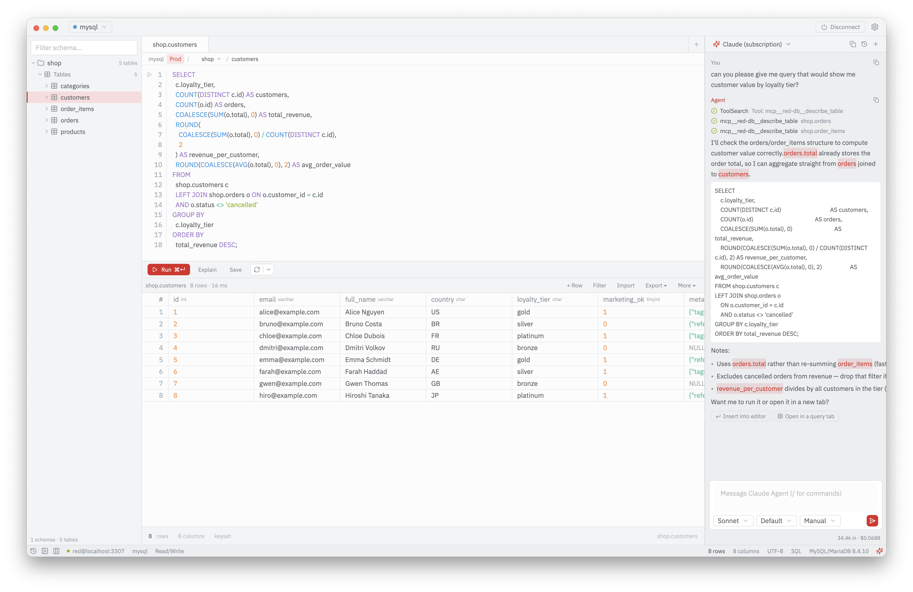

<div align="center">


# RED

**Roughly Enough Data.** A fast, native database explorer built in Rust.

[](https://github.com/vojir-mikulas/red/releases/latest)
[](https://github.com/vojir-mikulas/red/releases)
[](https://github.com/vojir-mikulas/red/actions/workflows/ci.yml)
[](https://github.com/vojir-mikulas/red/stargazers)
[](LICENSE)
[](#install)
[](#development)

</div>

<div align="center">
  
</div>

RED is for inspecting schemas, browsing large tables, running SQL, and exporting data. The name is the goal: show roughly enough data to make a decision quickly, without the weight of a full IDE-style database tool.

It's built on GPUI and renders on the GPU, so there's no Electron or embedded browser.

> **Status: MVP.** The core workflows are functional, but the UI and APIs are still moving. Expect rough edges and breaking changes before the first stable release.

## Databases

* **PostgreSQL**, **MySQL / MariaDB**, **SQLite**: browsing, querying, and transactional in-grid editing
* **ClickHouse**: browsing, querying, bulk insert, and in-grid editing through background mutations you can watch and cancel
* **Redis**: key browser, value lenses and decoders, console, keyspace notifications, slowlog and monitor
* **MongoDB**: document workspace with inferred schema, aggregation, explain, and document editing

## Features

**Browsing and querying**

* Schema explorer covering tables, views, materialized views, functions, procedures, triggers, sequences and types
* SQL editor with autocompletion, foreign-key-aware `JOIN` suggestions, inline diagnostics, and per-statement run
* Large tables stream through a windowed, keyset-paginated result grid instead of being materialized whole
* Find in results and in the editor; filter a result to a `WHERE` clause without rewriting the query
* Cell and row detail inspector, per-column statistics, split view of two tabs
* Watch mode: re-run a read-only query every few seconds, with changed cells flashing
* Query history and saved queries

**Editing and moving data**

* Inline editing with staged, reviewable batch changes
* Export to CSV, JSON, SQL `INSERT` statements, or a self-contained HTML report; import from CSV, JSONL, or a JSON array
* Copy a table to another connection, or migrate a set of tables into a new database
* Diff data between two tables, and compare schemas with reconciling DDL generated into a query tab

**Understanding a server**

* ER diagram built from foreign keys, with pan, zoom and fit
* Connection health report: sizes, unused indexes, missing keys, and other per-engine checks
* Server panel listing live sessions, with lock waits and their blockers marked and a guarded cancel or terminate
* Show DDL for any object in the schema tree

**Working against production**

* Read-only connections
* Environment markers (Local, Dev, Staging, Prod) that scale how much RED asks before a write
* Destructive statements are graded before they run, and the confirmation says how many rows they will touch

**Everything else**

* AI assistant sidebar with grounded chat over your schema, via the Claude API or a Claude subscription
* SSH tunneling through a jump host, SOCKS5 / HTTP proxies, and TLS
* Import saved connections from DBeaver and DBGate
* Multiple connections with a quick connection switcher and pinned favourites
* Themes (One Dark, GitHub Dark, Ayu Dark, Ayu Light, High Contrast) and a fully customizable keymap
* Headless CLI (`red query`, `exec`, `copy`, `migrate`, `test`, `connections`) and an MCP server (`red mcp`)

Default shortcuts are listed in [`docs/keyboard.md`](docs/keyboard.md), and every release is recorded in [`CHANGELOG.md`](CHANGELOG.md).

## Install

Prebuilt, signed binaries are on the [latest release](https://github.com/vojir-mikulas/red/releases/latest):

* **macOS**: download the `.dmg` (signed and notarized).
* **Linux**: download the `.AppImage`, `chmod +x` it, and run.
* **Windows**: download the `.exe`, or the `.zip` if you prefer to unpack it.

Or build from source; see [Development](#development).

On first launch RED seeds a small, read-only **Sample database** so you can explore the schema browser, run queries, and try the result grid immediately, with no database setup required.

## Privacy

RED has no telemetry and makes no network calls of its own. Connection credentials are stored in your operating system's keychain, never in plaintext. The AI assistant is opt-in and only talks to the provider you configure.

## Architecture

A GPUI main thread renders the interface while a Tokio backend service owns database sessions and query execution. The UI and backend communicate through a Command/Event channel bridge, so the interface never blocks on the database.

Workspace crates:

* `red`: desktop application
* `red-core`: shared domain types
* `red-driver`: database driver abstractions and implementations
* `red-service`: backend runtime and query lifecycle
* `red-config`: saved connections and OS-keychain access, shared by the app and the CLI
* `red-ai` / `red-acp`: AI assistant providers (direct API and agent-client-protocol)

UI components and theming come from Flint, a shared component library built on GPUI.

## Development

```sh
cargo run -p red
cargo test
cargo clippy --workspace --all-targets -- -D warnings
cargo fmt --all
```

> On macOS, building requires a full Xcode installation for Metal shader compilation. If `xcode-select` points to the Command Line Tools, set:
>
> `DEVELOPER_DIR=/Applications/Xcode.app/Contents/Developer`

See [`CONTRIBUTING.md`](CONTRIBUTING.md) for development setup and contribution guidelines.

## License

GPL-3.0-or-later.

RED links against GPUI, whose dependency tree includes GPL-licensed crates. See [`NOTICE`](NOTICE) for details.
